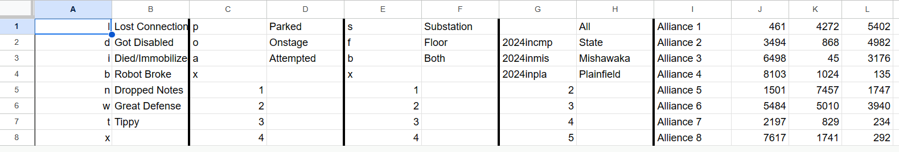
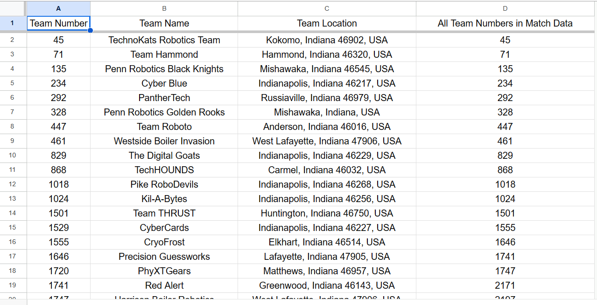
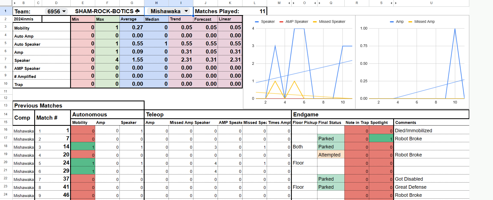
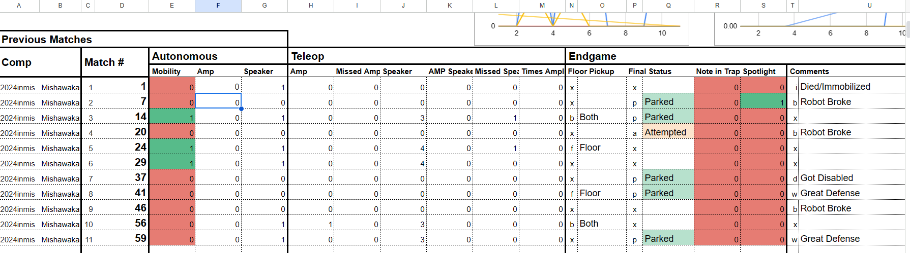
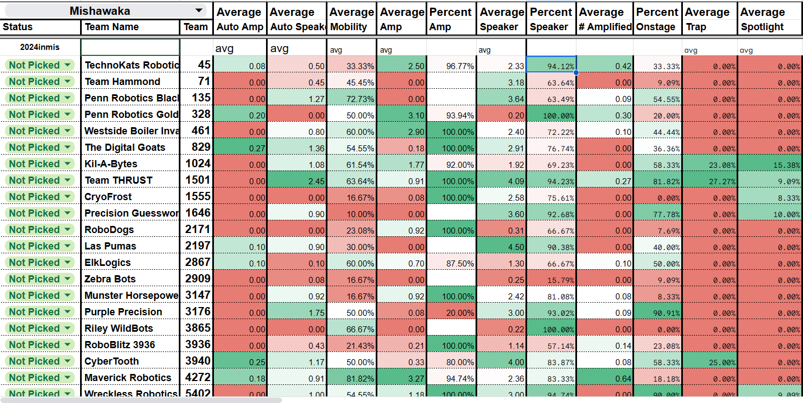

<div href="top"></div>

# SRB Google Sheets

## How SRB updates and uses Google Sheets for our scouting

<details>
  <summary>Content</summary>
  <ol>
    <li><a href="#description">Description</a></li>
    <li><a href="#creating">Creating the Sheets</a></li>
    <li><a href="#master">The Master List</a></li>
    <li><a href="#datainfo">Data Information and Settings</a></li>
    <li><a href="#teaminfo">Team Info</a></li>
    <li><a href="#robot">Robot Data</a></li>
    <li><a href="#compare">Comparing Data</a></li>
  </ol>
</details>

<div id="description"></div>

# Description

SRB uses google sheets to store and analyze all of our scouting data. We have one main scouting labtop that has the google sheet preloaded before a competition, and at competitions all the data is entered onto that google sheet using a qr code scanner in conjunction with the scouting site. 

One of the key components of our scouting is the ability to use it offline. The google sheets uses only built in functions to compile the data. No app scripts or macros can be used due to the neccessity of being offline. 

The bulk of the google sheets are built using the two funtions QUERY and FILTER. The QUERY function is a powerful tool to search data using different criteria. The FILTER function is used for the smaller searches when not all the data is needed to be looked through

<div id="creating"></div>

# Creating/Setting Up the Google Sheets

Every year, there is a new frc competition which means the scouting software must be changed every year. The first step is either to create a new google sheet or create a copy of last year's sheet to modify. When creating the sheet make sure to name it an appropriate name and share it with everyone working on scouting.

<div id="master"></div>

# The Master Data List

The Master sheet is where all the data is entered. It stores everything and it is where everything is referenced. It is important to set this sheet up correctly in order to set up any other sheet.


The first step when setting up this sheet is getting the columns named correctly. Each column needs the correct name that corresponds to the data inputted. To do this, the config file should be updated for this year so that the scouting website works as intended. More about that can be found [here](Updating.md). Once this is done, using the website or the config file, name the columns going down in order of what entry is listed first. For example, the first entry field is the event so the first column should be labeled event, the next is match type and so on all the way until every column is labeled. To know this is correct, use the scouting website, enter fake data and when you paste the data in, the end columns should align.

It is important to note that this sheet should not need changed. When pasting data, you can either copy and paste it in or use a qr code scanner which should automaticly paste it in after reading the qr code. Your cursor needs to be on the first column in order for the data to be pasted correcly otherwise your numbers will be off and there will be errors later down the line when the different data types don't match.

One helpful tip is to freeze the first row of the sheet so when you scroll down the sheet, the names of what each column represents is still present.

<div id="datainfo"></div>

# Data Information and Settings

The next step is the DataInfo sheet. This sheet has no functions, but is used as a key for the rest of the sheets. This is where you define what radio options mean what and what each event code means.



Each radio from the scouting site should have two columns to itself. One column is the letter and the other column is its corresponding option. This is also where you can define your event codes with their corresponding event names. In the case of wanting to view all events, leave event code blank; The same can be said if you want nothing to appear when none was selected where you can leave the option blank

There is a current bug with this system as all the blank letter or event code spaces must be filled for the system to work. In this example, numbers are used as a filler.

<div id="teaminfo"></div>

# Team Info

The Teams sheet is used as a reference sheet and has only one function. The first three columns are the team number, name, and location. The location is not used, however it is left in as it is pasted from [blue alliance](https://www.thebluealliance.com/events/in#teams) which does track the location. 



The fourth column tracks all the teams currently found in the match data. This is useful for checking if a specific team has match data or for tracking what teams have been scouted. The function used is ```=IFERROR(SORT(UNIQUE(ARRAYFORMULA(QUERY(Master!A2:S, "select E where E>0")),FALSE,FALSE)))```. This function first looks through the Master sheet using QUERY and selects the column E or all the team numbers scouted. ARRAYFORMULA converts the QUERY's output to an array where UNIQUE removes every duplicate team number. SORT sorts it least to greatest to help with searching. The last part IFERROR is used so that if there is an error or no data is found, the cell is left blank instead of creating an error.


<div id="robot"></div>

# Analyzing Robot Data

The Robot sheet is one of the most complex sheets. It is used to view a robots match data throughout one or more competitions



The Robot sheet can be split into 3 main parts, the actual match data, the robot statistics, and the search bar. A key component of this sheet is not the functions, but the organization, lines, colors, and text sizes to make every element easily readable where anyone can quickly find the information their looking for.


The first part is the search bar. This is located at the top of the sheet and allows the user to select what robot to view as well as what event to pull the statistics from. 

The formula for the dropdowns are '''=Teams!$D$2:$D''' and '''=DataInfo!$H$1:$H'''. These formulas create the dropdown options from the data that is pulled from the referenced sheet. The simple format is SheetName!Range where the sheet name has no spaces. The $ symbol means that no matter where the dropdown is if it were ever moved or pasted, the column and row letter and numbers stay the same. This is useful if your wanting to paste formulas without ranges changing

Another part of the search bar is the team name feature. This is a small QUERY that looks for the team name from the Teams sheet based off of the team number. (```=query(Teams!A2:C, "select B where A = "&D1&" order by B")```)



The second part is the match data portion. The basic idea of this section is one QUERY funtion that gathers all of the match data based off of the robot and event fields of the search bar

```=IFERROR(IF(len(D1)=0,"Please choose a value in D1",query(Master!A2:S,"select C, F, G, H, I, J, K, L, M, N, O where (E = "&D1&" "&if(B2=0,," AND A = '"&B2&"'")&")  order by E, A desc")))```

The QUERY searches through the entire Master sheet and selects certian columns of data to be displayed. This data also meets the criteria where the team number is the same as the one selected in the search bar. For this sheet, the cell B2 is a placeholder cell that gets the event code based off of the selected event. If that space has an event code, then the QUERY also matches the event codes while searching through the data. The cell B2 uses a simple FILTER (```=FILTER(DataInfo!$G$1:$G, DataInfo!$H$1:$H=$H$1)```) to pull the corresponding event code based off of the selected event. The last part is where it orders the data.

If you decide you want the meanings behind what the radio options mean within the match data, the first step is to break apart the QUERY. Add a column to the right of the data of the specific radio and split the QUERY columns in a way were all the columns after the radio option are in their own QUERY search, change the select portion of the QUERY to edit what columns you want on what side.

Once there is a blank column in the middle of the two queries, use a simple FILTER (```=IFERROR(IF(len($D$1)=0,,FILTER(DataInfo!$F$1:$F, DataInfo!$E$1:$E=$N16)))```) function to grab the corresponding meaning of the selected radio data where you defined what radio option meant what in the DataInfo sheet.

One feature used throught this sheet and others is the conditional formatting of google sheets. This is used to change the background color of certian cells based off of the values. It can be useful for quickly identifies good and not so good data without needing to read all the small numbers of data.

There are a couple of extra features on the match data section like counting the number of matches which is the funtion (```=IF(D16=0,,COUNT(D16) + C15 )```) that keeps track of how many matches were played by checking if a space is empty, if it's not count one and add it to the previous number of matches.

A useful feature with the Robot sheet is hiding certian cells if the scouter feels they are not needed. Simply click on the entire column at the top, right click, and select hide column.


The third and final part of the Robot sheet is the match statistics section. This section can be used to view certian robot statistics and provide predictions as to what future scores may look like. 

The funtions used for this section are the basic funtions of sheets like MIN, MAX, AVERAGE, MEDIAN. The tedious part is manually adding all the ranges for every match or score that you want to track. 

The TREND, FORCAST, and FORECAST.LINEAR funtions provide three different predictions on what the next match's score might look like for that robot. 

Utilizing google sheet's graphs is a useful way to visualize match data in an easy to read fashion. The example above tracks speaker and amp scores from the 2024 FRC Crecendo game. The graphs display the different amounts of scoring for each match with a more opaque trendline to view the change in the scores.


<div id="compare"></div>

# Comparing Robots

The Compare sheet is used to compare robots based from their different match data and from what event is selected. This sheet is also used as a way for scouters to determine a pick list for alliance selections. Not every column needs to be shown. Depending on the teams criteria for picking alliance partners, the scouters can hide columns in order to view only specific columns of data.



The dropdown for selecting the event is the same the one used in the Robot sheet, with the corresponding event code placeholder cell being A3.

The other dropdown being used as a marker for whether a team is picked, not picked, or other options is simply a created dropdown with those options and does not include any funtions.


<p align="right">(<a href="#top">back to top</a>)</p>